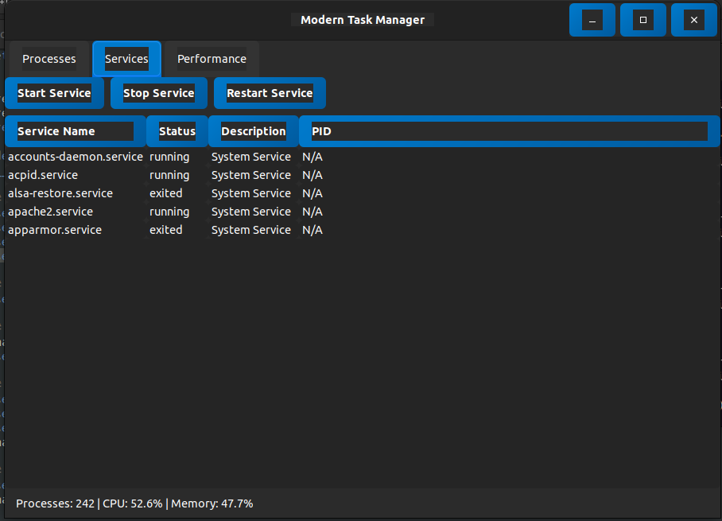
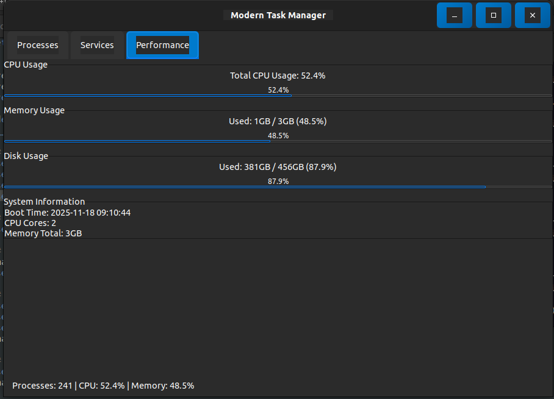

# Modern Task Manager (GTK3 + Python)

A sleek, dark-themed Linux task manager built with **GTK3**, **PyGObject**, and **psutil**  
for Ubuntu 22+. Includes real-time system monitoring, process control, and systemd service visibility.

<p align="center">
  
  
  
</p>

---

## ✨ Features

- 🧩 **Process Manager**
  - View CPU%, Memory%, PID, user and status  
  - Kill processes safely (with confirmation)  
  - Auto-refresh every 10 seconds  

- 🔧 **Systemd Services Viewer**
  - View (example) active services  
  - Extensible for service start/stop/restart  

- 📊 **Performance Dashboard**
  - CPU load  
  - RAM usage  
  - Disk usage  
  - System info (boot time, CPU cores)  

- 🌙 **Modern Dark UI**
  - Custom GTK CSS  
  - Rounded corners  
  - Flat gradients  
  - Small pixel-perfect layout adjustments  

---

## 🖥️ Screenshot
*(Add a screenshot here once you take one)*

---

## 🚀 Installation

### 1. Install required system packages
```bash
sudo apt update
sudo apt install -y python3 python3-pip python3-gi gir1.2-gtk-3.0

pip3 install -r requirements.txt
python3 src/modern_task_manager.py
